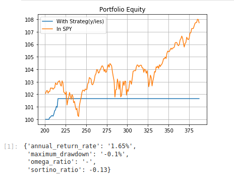

# algo-trading-workbench

A collection of scripts for trading strategy back-testing and OHLC (+ Volume) time series scraping.

## Purpose

To have a light-weight, event-driven backtesting script that produces a short report with the most common portfolio/strategy performance ratios & visualizes a comparison of said performance against common indices.
That way one can focus on rapid strategy development and have some data to decide whether or not the strateg(y/ies) should be allocated more time on a more robust testing platform.

An example generated report:

## Implementation

A Jupyter notebook connected to:

1. a small Python module I wrote to run an event-driven back-test
2. a Node/Express/Playwright service for scraping time series data wherever the officially used API isn't an option

The Python module consists of the following chain of files (which may be used independently, but have been constructed to work best together):

1. A `DataFetcher` class which handles fetching `.csv` historical OHLC(+ Volume) time series, saving it to a file & returning a `pandas` dataframe.
2. A `Strategy` class which takes in several arguments, most important of which 2 functions to define entry and exit criteria for the strategy. (See `mean_reversion_strategy.py` & `momentum_strategy.py` for examples of such functions).
3. A `Portfolio` class which keeps track of capital, registers strategies for use & at the end of a period returns equity data for the next class, which returns the actual report.
4. `PerformanceReport` - takes equity data, calculates several risk/reward ratios + max drawdown during the active trading period and returns a small object with them.

## Integrations

For the OHLC time series 2 integrations exist:

1. AlphaVantage (data provider with an API, only has data on US/Canadian & Crypto securities AFAIK). Chosen because of their Free API & adjusted time series functionality + support for cryptocurrencies.
2. Avanza Bank (Swedish neo-bank whose page I've built a script to extract OHLC + Volume data on Stocks from). Chosen because option nr.1 does not have data on European & Asian stocks (e.g DAX, OMX, etc).

## Project structure

### `/backtesting`

Contains the actual Jupyter notebook workbench from which:

1. the main loop for the back-test is run,
2. the test/portfolio/strategy settings & data provider keys are propagated further into the module

### `/web_scraping`

Contains a short script that brings up an ExpressJS server that in turn uses Playwright to parse Avanza's page to provide OHLC (+ Volume) time series data in the same `.csv` format as AlphaVantage's API.

## Running

1. (assumming you have jupyter notebook / VSCode with the proper extensions enabled / your choice of notebook engine) `jupyter lab` (in `/backtesting`)
2. Then make sure you have your AlphaVantage API token set as environment variables.
3. Bring the `web_scraping/` service up by running `yarn start` (after making sure you have the necessary `node_modules` by running `yarn` ofc)
4. Click run on the main cell (wait for the time series to be downloaded, which usually takes roughly a minute if one of the strategies uses the web scraper, otherwise some 20 odd seconds)
5. Inspect the performance report
